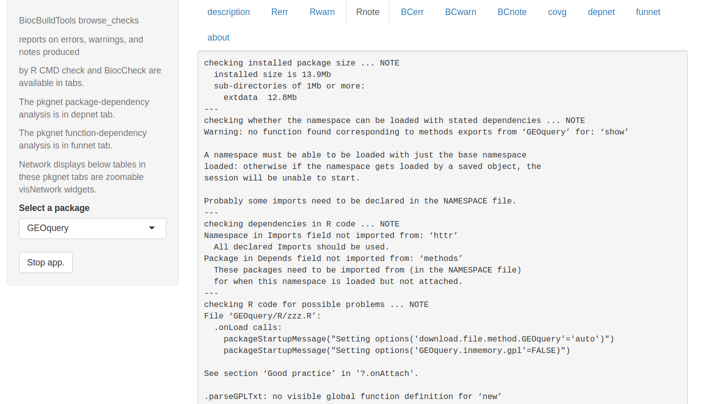
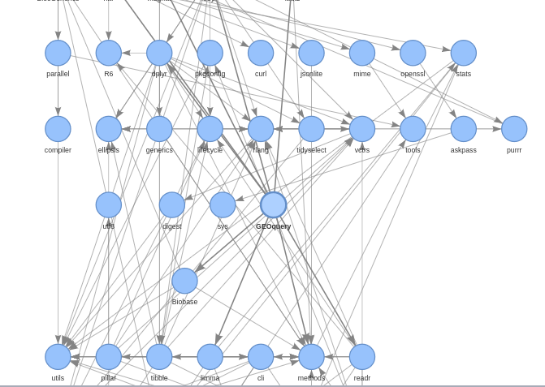

```{r setup,echo=FALSE,results="hide"}
suppressMessages({
suppressPackageStartupMessages({
library(BiocStyle)
library(BiocBuildTools)
library(BiocPkgTools)
library(igraph)
library(dplyr)
library(magrittr)
})
})
```

# Basic concepts

## Release and devel collections

The Bioconductor project has fostered development and
use of software for analysis of state-of-the-art
genome-scale assays for almost two decades.  The
project has successfully addressed two 
conflicting objectives:

- Users require familiar and stable toolsets to
perform analyses that may take years to complete.

- Developers want to make use of cutting-edge innovations
in biotechnology and computer science to build their
tools.

To achieve these objectives, it was recognized at the
outset of the project that package management should emulate the
process by which the R language evolves.  A "release
branch" is defined that constitutes a stable
collection.  Changes to packages in the release
branch are permitted to address bugs or documentation
shortfalls; otherwise, code in the release branch
is considered permanently locked.  Changes to
packages in the "devel branch" can introduce
new features.
A change to a package in the devel branch
that alters that package's API in release must be staged:
the "old" API components that are to
be removed must remain available for one release in
"deprecated" state, after which these components can be declared defunct
and removed from functionality.

To accommodate the rapid pace of innovation in biotechnology,
release branches of Bioconductor packages are produced
every six months, transitioning from the current devel branch.
For code from the devel branch to transition into release,
formal tests must be passed.

## Implementation of release and devel collections in git

The ensemble of R packages managed and distributed in the
Bioconductor project is a collection of git repositories.
The "devel" version of each package is the "master"
branch of the associated repository.  The "release"
version of each package is a formally tagged
branch of the associated repository.  The complete
history of code changes to each package is preserved
in the git log and branch tags of the form
`RELEASE_X_Y` identify the various package releases.

In summary, each git repository for each Bioconductor package
contains the history of modifications to source code and
documentation, with the master branch providing the current devel image,
and `RELEASE_X_Y` tagged branches providing past releases.

# The current package collections

Bioconductor has three main package types: software, annotation,
and experiment.  'Software' packages primarily support analysis
and visualization, 'annotation' packages provide reference
information about genomes, genes, and other concepts of biology,
and 'experiment' packages provide curated data and documentation
for exemplary experiments.

To obtain the list of package names, we use the
git repo git.bioconductor.org/admin/manifest, which has
three text files with package names for each of the three
types.

# A small collection for illustration

We identified a small group of packages and took
a snapshot of the associated repositories.

```{r lkzip}
library(BiocBuildTools)
bioc_coreset()
```

In the following, we unzip the snapshot in a temporary
folder.
```{r dounz}
td = tempdir()
curd = getwd()
setwd(td)
file.copy(system.file("demo_srcs", package="BiocBuildTools"), td, recursive=TRUE)
setwd(curd) # for knitr
```

## Self-testing

Bioconductor's guidelines for contributions indicate that
contributed packages must pass `R CMD check`, a constantly
evolving procedure for assessing adequacy of package
documentation and risks of error in package code.

We'll use the `r BiocStyle::CRANpkg("rcmdcheck")` package to capture information
on package compliance to basic standards.  This runs `R CMD check`
and organizes the message stream from that process.
```{r doch, cache=FALSE}
setwd(td)
chk_parody = rcmdcheck::rcmdcheck("demo_srcs/parody", quiet=TRUE)
names(chk_parody)
setwd(curd) # for knitr
```
The basic outcomes of a 'passed' check process are listed here:
```{r lkcnts}
c(nerr=length(chk_parody$errors),nwarn= length(chk_parody$warnings),
nnote= length(chk_parody$notes))
```
No error was detected, but a warning and several notes were
reported.  We will look at these in further detail below.

## Implicit interoperability testing

A goal of the core members of the Bioconductor project is the development
of reusable infrastructure components that are employed by independent
package contributors.  Programming
with common data structures and APIs simplifies development
of chained workflows, and facilitates methods comparison and optimization.
Reusable components can be analyzed
for inefficiencies and improved to the benefit of the entire community
of users and developers.

R packages declare interdependencies explicitly in the `DESCRIPTION`
file.  An example is
```{r lkdesc}
setwd(td)
dcf = read.dcf("demo_srcs/HCAExplorer/DESCRIPTION")
cat(dcf[,"Imports"])
cat("\n")
setwd(curd)
```
The fields `Depends`, `Imports`, `Suggests` and `LinkingTo` define
the independently maintained packages that must be available for
`r BiocStyle::Biocpkg("HCAExplorer")` to work effectively.  Details on 
these types of dependency are provided in 
[Writing R Extensions](https://cran.r-project.org/doc/manuals/r-release/R-exts.html).

We can visualize the interdependencies of a small collection
using `r BiocStyle::Biocpkg("BiocPkgTools")`.

```{r getg, fig.height=6}
suppressMessages({
library(BiocPkgTools)
library(BiocBuildTools)
library(dplyr)
library(magrittr)
})
dd = buildPkgDependencyDataFrame()
dfc = dd %>% filter(Package %in% bioc_coreset() & dependency %in% bioc_coreset()) 
gg = buildPkgDependencyIgraph(dfc)
plot(gg)
```

Some of the packages in the small set are isolated.
```{r lkiso}
setdiff(bioc_coreset(), union(dfc$Package, dfc$dependency))
```

# Supporting developers with build system enhancements

The current build system has functioned well as the
software collection has grown from a few hundred to more
than 1800 packages.  The key resources for developers
are

- daily builds and checks of all packages on Linux, Windows and macOS
- reports of check process outcomes
- simplified distribution of packages and all dependencies via `BiocManager::install`
- programmatic check for outdated packages via `BiocManager::valid`

We propose to enhance these facilities by 

- providing more structure in the check process report to
guide developers towards quality improvements
- adding information on self-testing and
package interdependencies to check process reports
- strengthening social coding practice by simplifying pull request production
- making the build system platforms continuously available for
developer testing

The last aim will take considerable work and discussion is
deferred. 


## Improving check report delivery

Here is a screen shot of the `browse_checks` app in BiocBuildTools



We use pkgnet to generate network statistics and displays related
to package and function dependencies.



TO DO: 

- parse URL entry of DESCRIPTION and add 'start a pull request' at each
relevant part of the report
- ingest unit tests and add a tab that provides their source code
- develop code coverage reports and convey them -- this is probably
to be done off line
- other social coding support
